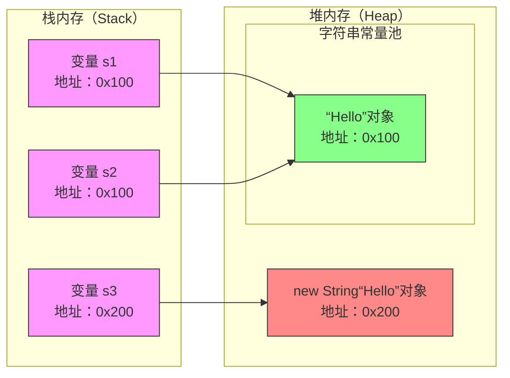

# Java常用API


## `String`

### 字符串定义方法：

```java
package com.n1etzsch3.stringdemo;

public class StringDemo {
    public static void main(String[] args) {
        // 字符串常用定义方法
        // 1. 字符串字面量，最常用。
        String str1 = "Hello, World!";

        // 2. 使用 new 关键字创建字符串对象
        String str2 = new String("Hello, World!");

        // 3. 字符数组转换为字符串
        char[] charArray = {'H', 'e', 'l', 'l', 'o', ',', ' ', 'W', 'o', 'r', 'l', 'd', '!'};
        String str3 = new String(charArray);

        // 4. 字节数组转换为字符串
        byte[] byteArray = {72, 101, 108, 108, 111, 44, 32, 87, 111, 114, 108, 100, 33};
        String str4 = new String(byteArray);
    }

}

```

> <font color=red>双引号创建字符串和 new 关键字创建字符串的区别：
> 双引号创建的字符串是**字符串常量**，**存储在字符串池中**。`new`关键字创建的字符串是**字符串对象**，**存储在堆内存中**</font>

```java
package com.n1etzsch3.stringdemo;

public class StringDemo {
    public static void main(String[] args) {
        String s1 = "Hello";
        String s2 = "Hello";
        String s3 = new String("Hello");

        System.out.println(s1 == s2); // 返回值为真，因为s1和s2指向同一个字符串常量池中的对象
        System.out.println(s1 == s3); // 返回值为假，因为s3是通过new关键字创建的，指向堆内存中的新对象
    }
}

```




> **这种设计可以节约内存。**


### 字符串常用方法

|    **类别**    |                         **方法签名**                         | **返回值** |                 **说明**                 |                  **示例**                  |
| :------------: | :----------------------------------------------------------: | :--------: | :--------------------------------------: | :----------------------------------------: |
| **长度与判空** |                        `int length()`                        |    int     |              返回字符串长度              |           `"Java".length()` → 4            |
|                |                     `boolean isEmpty()`                      |  boolean   |            检查字符串是否为空            |           `"".isEmpty()` → true            |
| **字符与索引** |                   `char charAt(int index)`                   |    char    |           返回指定索引处的字符           |          `"Java".charAt(1)` → 'a'          |
|                |                  `int indexOf(String str)`                   |    int     | 返回子串第一次出现的索引（未找到返回-1） |        `"apple".indexOf("pl")` → 2         |
|                |                    `int indexOf(int ch)`                     |    int     |         返回字符第一次出现的索引         |         `"Java".indexOf('a')` → 1          |
|                |                `int lastIndexOf(String str)`                 |    int     |        返回子串最后一次出现的索引        |       `"miss".lastIndexOf("s")` → 3        |
|  **比较操作**  |                 `boolean equals(Object obj)`                 |  boolean   |     严格比较字符串内容（区分大小写）     |      `"Java".equals("java")` → false       |
|                |            `boolean equalsIgnoreCase(String str)`            |  boolean   |         忽略大小写比较字符串内容         |  `"Java".equalsIgnoreCase("java")` → true  |
|                |            `int compareTo(String anotherString)`             |    int     |     按字典顺序比较字符串（<0/0/>0）      |         `"a".compareTo("b")` → -1          |
|  **子串操作**  |              `String substring(int beginIndex)`              |   String   |        从起始索引截取到字符串末尾        |      `"Hello".substring(1)` → "ello"       |
|                |       `String substring(int beginIndex, int endIndex)`       |   String   |     截取指定区间的子串（含头不含尾）     |      `"Hello".substring(1,4)` → "ell"      |
|                |                 `String concat(String str)`                  |   String   |       字符串连接（等价于+操作符）        |      `"Hello".concat("!")` → "Hello!"      |
| **转换与替换** |                    `String toLowerCase()`                    |   String   |               转换为全小写               |      `"JAVA".toLowerCase()` → "java"       |
|                |                    `String toUpperCase()`                    |   String   |               转换为全大写               |      `"java".toUpperCase()` → "JAVA"       |
|                |                       `String trim()`                        |   String   |             移除两端空白字符             |         `" Java ".trim()` → "Java"         |
|                |         `String replace(char oldChar, char newChar)`         |   String   |             替换所有指定字符             |    `"hello".replace('l','p')` → "heppo"    |
|                | `String replace(CharSequence target, CharSequence replacement)` |   String   |             替换所有指定子串             |      `"cat".replace("c","b")` → "bat"      |
| **匹配与判断** |              `boolean contains(CharSequence s)`              |  boolean   |           判断是否包含指定子串           |       `"Java".contains("av")` → true       |
|                |             `boolean startsWith(String prefix)`              |  boolean   |          判断是否以指定前缀开头          |   `"file.txt".startsWith("file")` → true   |
|                |              `boolean endsWith(String suffix)`               |  boolean   |          判断是否以指定后缀结尾          |    `"logo.png".endsWith(".png")` → true    |
| **拆分与正则** |                `String[] split(String regex)`                |  String[]  |          按正则表达式拆分字符串          |    `"a,b,c".split(",")` → ["a","b","c"]    |
|                |               `boolean matches(String regex)`                |  boolean   |       判断字符串是否匹配正则表达式       |       `"123".matches("\\d+")` → true       |
|  **类型转换**  |            `static String valueOf(primitive/obj)`            |   String   |        将基本类型/对象转为字符串         |       `String.valueOf(123)` → "123"        |
|                |    `static String format(String format, Object... args)`     |   String   |        格式化字符串（类似printf）        |      `String.format("Name:%s","Tom")`      |
|  **其他操作**  |                    `char[] toCharArray()`                    |   char[]   |              转换为字符数组              | `"Java".toCharArray()` → ['J','a','v','a'] |
|                |            `String repeat(int count)` *(JDK11+)*             |   String   |            重复字符串指定次数            |          `"A".repeat(3)` → "AAA"           |
|                |                 `int codePointAt(int index)`                 |    int     |       返回索引处字符的Unicode码点        |         `"A".codePointAt(0)` → 65          |
|                |                `boolean isBlank()` *(JDK11+)*                |  boolean   |    检查字符串是否为空或仅包含空白字符    |          `"  ".isBlank()` → true           |

### 重要特性说明：

1. **不可变性**：所有字符串方法均返回新字符串对象，原始字符串不变

2. **正则表达式**：`split()`、`matches()`、`replaceAll()`等方法使用正则语法

3. 

   空白处理

   ：

   - `trim()`仅移除两端空白（ASCII值≤32的字符）
   - `isBlank()`检测任何空白字符（包括Unicode空白）

> 完整文档参考：[Oracle String API](https://docs.oracle.com/javase/8/docs/api/java/lang/String.html)


## `StringBuilder`

### 什么是StringBuilder？

`StringBuilder` 是 Java 中一个**可变的字符序列**类，用于高效地创建和修改字符串。它是对不可变字符串 `String`类的补充，特别适合需要**频繁修改**字符串内容的场景。

### 主要特点

| 特性           | 说明                         |
| -------------- | ---------------------------- |
| **可变性**     | 内容可修改，不会创建新对象   |
| **非线程安全** | 没有同步机制，性能更高       |
| **高效操作**   | 特别适合频繁修改字符串的场景 |
| **链式调用**   | 支持方法链式操作             |
| **动态扩容**   | 自动管理底层字符数组的容量   |

### 与String的对比

| 特性         | String           | StringBuilder  |
| ------------ | ---------------- | -------------- |
| **可变性**   | ❌ 不可变         | ✅ 可变         |
| **线程安全** | ✅ 线程安全       | ❌ 非线程安全   |
| **性能**     | 不适合频繁修改   | 适合频繁修改   |
| **内存使用** | 修改时创建新对象 | 直接修改原对象 |
| **使用场景** | 少量操作         | 大量修改操作   |

### 核心方法

#### 1. 构造方法

| 方法                              | 说明                   |
| --------------------------------- | ---------------------- |
| `StringBuilder()`                 | 创建初始容量16的空对象 |
| `StringBuilder(int capacity)`     | 指定初始容量           |
| `StringBuilder(CharSequence seq)` | 使用字符序列初始化     |
| `StringBuilder(String str)`       | 使用字符串初始化       |

```java
StringBuilder sb1 = new StringBuilder();          // 空对象
StringBuilder sb2 = new StringBuilder(100);      // 容量100
StringBuilder sb3 = new StringBuilder("Hello");  // 初始值为"Hello"
```

#### 2. 追加方法 - append()

```java
StringBuilder sb = new StringBuilder();
sb.append("Hello").append(", ").append(2023).append("!");
// 结果: "Hello, 2023!"
```

可追加类型：

- 所有基本类型（int, long, float, double, boolean）
- 字符和字符数组
- 对象（调用toString()）
- StringBuffer、StringBuilder

#### 3. 插入方法 - insert()

```java
StringBuilder sb = new StringBuilder("World");
sb.insert(0, "Hello ");  // 在索引0处插入
// 结果: "Hello World"
```

#### 4. 删除方法

| 方法                         | 说明                     |
| ---------------------------- | ------------------------ |
| `delete(int start, int end)` | 删除[start, end)区间内容 |
| `deleteCharAt(int index)`    | 删除指定位置字符         |

```java
StringBuilder sb = new StringBuilder("ABCDEFG");
sb.delete(2, 5);     // 删除索引2到5(不含) → "ABFG"
sb.deleteCharAt(0);  // 删除第一个字符 → "BFG"
```

#### 5. 替换方法

| 方法                                      | 说明                     |
| ----------------------------------------- | ------------------------ |
| `replace(int start, int end, String str)` | 替换[start, end)区间内容 |
| `setCharAt(int index, char ch)`           | 替换单个字符             |

```java
StringBuilder sb = new StringBuilder("I like apples");
sb.replace(7, 12, "oranges"); // 替换 → "I like oranges"
sb.setCharAt(0, 'i');         // 替换第一个字符 → "i like oranges"
```

#### 6. 反转方法 - reverse()

```java
StringBuilder sb = new StringBuilder("Java");
sb.reverse(); // 反转 → "avaJ"
```

#### 7. 容量管理

| 方法                       | 说明             |
| -------------------------- | ---------------- |
| `ensureCapacity(int min)`  | 确保至少最小容量 |
| `setLength(int newLength)` | 设置字符序列长度 |
| `trimToSize()`             | 回收多余空间     |
| `capacity()`               | 返回当前容量     |
| `length()`                 | 返回实际长度     |

```java
StringBuilder sb = new StringBuilder();
sb.ensureCapacity(100); // 确保容量>=100
sb.append("Text");
sb.trimToSize();        // 回收未使用的空间
```

#### 最佳实践

1. **循环中使用**：在循环中执行字符串拼接时，使用 StringBuilder 避免内存浪费

   ```java
   // 错误示范（内存效率低）
   String result = "";
   for (int i = 0; i < 1000; i++) {
       result += i; // 每次创建新String对象
   }
   
   // 正确示范
   StringBuilder sb = new StringBuilder();
   for (int i = 0; i < 1000; i++) {
       sb.append(i);
   }
   String result = sb.toString();
   ```

2. **链式操作**：利用链式调用简化代码

   ```java
   String formatted = new StringBuilder()
       .append("Name: ").append(name).append(", ")
       .append("Age: ").append(age)
       .toString();
   ```

3. **预估容量**：提前设置足够容量避免频繁扩容

   ```java
   // 预估需要存储10000个字符
   StringBuilder sb = new StringBuilder(10000);
   ```

### StringBuilder vs StringBuffer

| 特性         | StringBuilder    | StringBuffer           |
| ------------ | ---------------- | ---------------------- |
| **线程安全** | 否               | 是（synchronized方法） |
| **性能**     | 更高（约10-15%） | 略低                   |
| **使用场景** | 单线程环境       | 多线程环境             |

> 一般优先使用 StringBuilder，仅在需要线程安全时使用 StringBuffer

### 何时使用StringBuilder

1. 需要修改字符串内容
2. 大量字符串拼接操作
3. 频繁插入/删除字符
4. 需要反转字符串
5. 构建大型字符串（XML/JSON/SQL语句）

记住简单原则：
​**一次构建 → StringBuilder**​
​**一次赋值 → String**

### 实例代码：验证码判断

```java
package com.n1etzsch3.stringdemo2;

import java.util.Scanner;

public class VerificationCode {
    public static void main(String[] args) {
        // 生成一个6位的验证码，并要求用户输入该验证码进行验证
        String code = generateCode(6);
        System.out.println("Generated Verification Code: " + code);
        Scanner sc = new Scanner(System.in);

        // 循环验证用户输入的验证码是否正确
        boolean flag = true;
        while (flag){
            System.out.print("Please enter the verification code (Case Sensitive) : ");
            String input = sc.nextLine();
            if (verifyCode(code, input)) {
                System.out.println("Verification successful!");
                flag = false;
            } else {
                System.out.println("Verification failed. Please try again.");
            }
        }

        System.out.println("Welcome to the system!");
    }

  	// 随机生成器
    public static String generateCode(int length) {
        // 使用StringBuilder保存生成的验证码
        StringBuilder code = new StringBuilder();
        String characters = "ABCDEFGHIJKLMNOPQRSTUVWXYZabcdefghijklmnopqrstuvwxyz0123456789";
        for (int i = 0; i < length; i++) {
            int index = (int) (Math.random() * characters.length());
            code.append(characters.charAt(index));  // 调用append方法将字符添加到StringBuilder中
        }
        return code.toString();
    }

    /**
     * 验证用户输入的验证码是否正确
     * @param code 生成的验证码
     * @param input 用户输入的验证码
     * @return 如果验证码匹配返回true，否则返回false
     */
    public static boolean verifyCode(String code, String input) {
        return code.equals(input);
    }
}
```


## `ArrayList`

​	`ArrayList`即**集合**，是一种容器，类似于数组。

+ 数组定义完成并启动后，**长度就固定了。**
+ 集合**大小可变**，功能丰富，开发中用的更多。

### 创建集合：

```java
// 导入类
import java.util.ArrayList;

// 创建ArrayList（存储String类型）
// 一个ArrayList中可以存储任意类型的数据，使用泛型使其只能存储某个特定类型的数据。
ArrayList<String> list = new ArrayList<>(); 

// 指定初始容量（避免频繁扩容）
ArrayList<Integer> numbers = new ArrayList<>(20); 
```

> **`<E>`称为泛型，允许在定义类、接口或方法时使用类型参数**。

### 集合的基本操作：

```java
package com.n1etzsch3.arraylist;

import java.util.ArrayList;

public class ArrayListDemo1 {
    public static void main(String[] args) {
        ArrayList<String> list = new ArrayList<>();  // 泛型定义集合

        // 1、添加元素
        list.add("Hello");
        list.add("Java2");
        list.add("Java");  // 使用add方法添加元素
        // 2、删除元素
        list.remove("Hello");  // 使用remove方法删除元素
        list.remove(1);  // 使用remove方法删除指定索引位置的元素
        // 3、修改元素
        list.set(0, "World");  // 使用set方法修改指定索引位置的元素
        // 4、查看元素
        String element = list.get(0);  // 使用get方法获取指定索引位置的元素
        System.out.println("第一个元素是: " + element);  // 输出第一个元素
        // 5、查看集合大小
        int size = list.size();  // 使用size方法获取集合的大小
        System.out.println("集合的大小是: " + size);  // 输出集合的大小
        // 6、遍历集合
        for (String str : list) {  // 使用增强for循环遍历集合
            System.out.println("集合中的元素: " + str);  // 输出每个元素
        }
    }
}

```

#### 基本操作表

|         方法          |        功能        |                    示例                    |
| :-------------------: | :----------------: | :----------------------------------------: |
|      `add(E e)`       |   添加元素到末尾   |            `list.add("Java");`             |
| `add(int index, E e)` | 在指定位置插入元素 |          `list.add(0, "Python");`          |
|   `get(int index)`    |  获取指定位置元素  |         `String s = list.get(0);`          |
| `set(int index, E e)` |  替换指定位置元素  |           `list.set(1, "C++");`            |
|  `remove(int index)`  |  删除指定位置元素  |             `list.remove(0);`              |
|  `remove(Object o)`   | 删除首次出现的元素 |           `list.remove("Java");`           |
|       `size()`        |    返回元素数量    |          `int len = list.size();`          |
| `contains(Object o)`  |  检查是否包含元素  | `boolean hasJava = list.contains("Java");` |
|       `clear()`       |    清空所有元素    |              `list.clear();`               |
|      `isEmpty()`      |    判断是否为空    |        `if (list.isEmpty()) {...}`         |


### `ArrayList`与数组的区别：

|   **特性**   |              **数组**               |                      **ArrayList**                      |
| :----------: | :---------------------------------: | :-----------------------------------------------------: |
|   **大小**   |      固定长度（创建后不可变）       |           动态扩容（初始容量10，满时扩容50%）           |
|   **类型**   |  支持基本类型（`int[]`）和对象类型  |        仅支持对象类型（需用包装类如 `Integer`）         |
|   **功能**   | 基础操作（长度通过 `.length` 获取） |            丰富的方法（添加、删除、搜索等）             |
|   **性能**   |        内存连续，访问速度快         | 随机访问快，但插入/删除可能需移动元素（中间操作效率低） |
|  **灵活性**  |           需手动管理容量            |             自动管理容量，提供泛型类型安全              |
| **内存开销** |       更低（无额外对象开销）        |            更高（需维护内部数组和结构信息）             |
