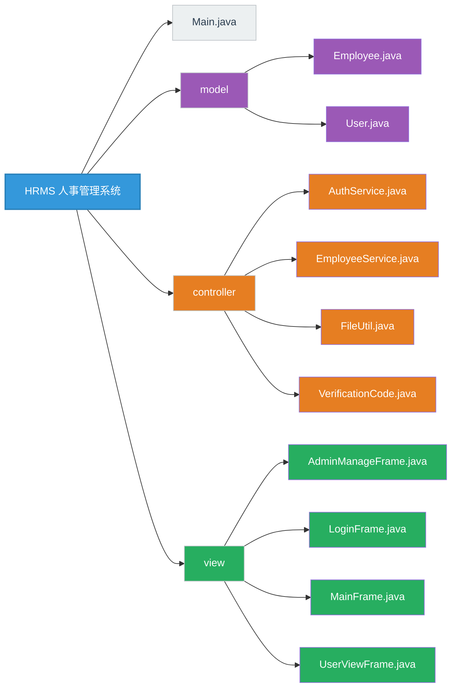

# 人事管理系统


## 需求

+ 提供一个登陆和注册用户的界面（注意权限管理）。

+ 提供一个人事信息的管理界面，能够对全部员工信息增删改查。
+ 项目的角色：
  + 登陆用户：普通用户（只能查看）、管理员（全权限）。
  + 员工信息：员工ID、姓名、性别、年龄、电话、部门、岗位。
+ 系统界面：
  + 主界面，分为用户登陆、注册和管理员登陆。（两个按钮：“我是用户”，“我是管理员”）。
  + 登陆\注册界面：用户名，密码，验证码（渲染成图片、点击更换功能）。
  + 普通用户：查看界面。
  + 管理员用户：后台增删改查界面，查看界面。

+ 存储：
  + 考虑用csv轻量化本地存储，两张数据表，一张员工信息，一张用户/管理员。

## 架构

+ ### MVC架构




+ ### 详细组件描述

|      模块      |         组件          |   功能描述   |              关键特性              |
| :------------: | :-------------------: | :----------: | :--------------------------------: |
|   **model**    |     Employee.java     | 员工数据模型 | 定义员工ID、姓名、性别、年龄等字段 |
|                |       User.java       | 用户数据模型 |  存储用户名、密码哈希和管理员标志  |
| **controller** |   AuthService.java    |   认证服务   |    处理用户登录、注册和权限验证    |
|                | EmployeeService.java  |   员工服务   |     实现员工数据的增删改查操作     |
|                |     FileUtil.java     |   文件工具   |        CSV文件读写和初始化         |
|                | VerificationCode.java | 验证码生成器 |      创建带干扰线的图形验证码      |
|    **view**    | AdminManageFrame.java |  管理员界面  |    提供员工管理功能（增删改查）    |
|                |    LoginFrame.java    |   登录界面   |         用户认证和注册功能         |
|                |    MainFrame.java     |    主界面    |       系统入口，选择用户类型       |
|                |  UserViewFrame.java   |   用户界面   |        普通用户查看员工信息        |


## 数据生成器

​	为了测试系统功能，给系统一个初始数据，用py脚本开发了一个数据生成器。

```python
import csv
import random
from datetime import datetime

# 配置参数 - 可以修改这些值来控制生成的数据量
NUM_EMPLOYEES = 100  # 生成的员工记录数量
OUTPUT_FILENAME = "employees.csv"  # 输出文件名

# 常用姓氏列表（20个）
SURNAMES = [
    "张", "王", "李", "赵", "陈",
    "刘", "杨", "黄", "周", "吴",
    "郑", "孙", "马", "胡", "林",
    "郭", "何", "高", "罗", "梁"
]

# 常用名字单字列表（50个）
GIVEN_NAME_CHARS = [
    "伟", "芳", "娜", "敏", "静",
    "丽", "强", "磊", "洋", "艳",
    "勇", "军", "杰", "涛", "明",
    "超", "鹏", "华", "平", "建",
    "刚", "亮", "峰", "晨", "浩",
    "宇", "俊", "思", "源", "轩",
    "航", "泽", "梓", "涵", "诺",
    "怡", "诗", "雨", "梦", "萱",
    "然", "文", "佑", "瑜", "瀚",
    "嫣", "曦", "嘉", "雯", "彤"
]

# 部门及其对应的职位
DEPARTMENTS = {
    "技术部": ["Java工程师", "Python工程师", "前端工程师", "后端工程师", "测试工程师",
               "系统架构师", "DevOps工程师", "大数据工程师", "AI工程师"],
    "市场部": ["市场专员", "品牌经理", "销售代表", "营销经理", "公关专员",
               "渠道经理", "客户关系经理", "市场分析师"],
    "人力资源部": ["招聘专员", "培训师", "薪酬福利专员", "HRBP", "组织发展专员",
                   "员工关系专员", "企业文化专员"],
    "财务部": ["会计", "财务分析师", "出纳", "审计", "税务专员",
               "财务经理", "成本会计师"],
    "行政部": ["行政助理", "前台", "办公室经理", "后勤主管", "设备管理员",
               "采购专员", "商务专员"]
}

# 性别列表
GENDERS = ["男", "女"]

# 电话号码前缀（确保是合法的11位手机号开头）
PHONE_PREFIXES = ["130", "131", "132", "133", "134", "135", "136", "137", "138", "139",
                  "150", "151", "152", "153", "155", "156", "157", "158", "159",
                  "180", "181", "182", "183", "184", "185", "186", "187", "188", "189"]


def generate_name():
    """生成随机姓名（保证2字或3字）"""
    surname = random.choice(SURNAMES)

    # 名字长度：1（总长2）或2（总长3）
    name_length = random.choice([1, 2])

    # 随机选择名字字符
    given_name = "".join(random.sample(GIVEN_NAME_CHARS, k=name_length))

    return surname + given_name


def generate_phone():
    """生成11位手机号码"""
    prefix = random.choice(PHONE_PREFIXES)
    # 生成剩余的8位数字
    suffix = ''.join([str(random.randint(0, 9)) for _ in range(8)])
    return prefix + suffix


def generate_employee(id):
    """生成单个员工记录"""
    name = generate_name()
    gender = random.choice(GENDERS)

    # 年龄范围设定在20-65岁之间
    age = random.randint(20, 65)

    phone = generate_phone()

    # 随机选择部门和对应的职位
    department = random.choice(list(DEPARTMENTS.keys()))
    position = random.choice(DEPARTMENTS[department])

    return [id, name, gender, age, phone, department, position]


def generate_employee_data(num_employees):
    """生成员工数据"""
    employees = []
    for i in range(1, num_employees + 1):
        employees.append(generate_employee(i))
    return employees


def save_to_csv(data, filename):
    """将数据保存为CSV文件"""
    headers = ["id", "name", "gender", "age", "phone", "department", "position"]

    with open(filename, 'w', newline='', encoding='utf-8-sig') as f:  # utf-8-sig 解决中文Excel乱码问题
        writer = csv.writer(f)
        writer.writerow(headers)
        writer.writerows(data)

    print(f"已成功生成 {len(data)} 条员工数据到文件: {filename}")


def main():
    print("=== 员工数据生成器 ===")
    print(f"计划生成员工数量: {NUM_EMPLOYEES}")

    start_time = datetime.now()
    employee_data = generate_employee_data(NUM_EMPLOYEES)
    save_to_csv(employee_data, OUTPUT_FILENAME)

    end_time = datetime.now()
    duration = (end_time - start_time).total_seconds()

    print(f"数据生成完成! 总耗时: {duration:.3f} 秒")
    print(f"生成的姓名示例: {employee_data[0][1]}, {employee_data[1][1]}, {employee_data[2][1]}")


if __name__ == "__main__":
    main()
```

