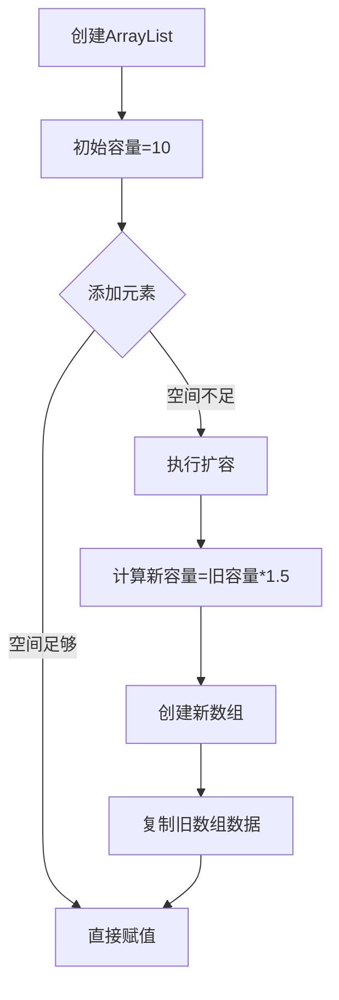
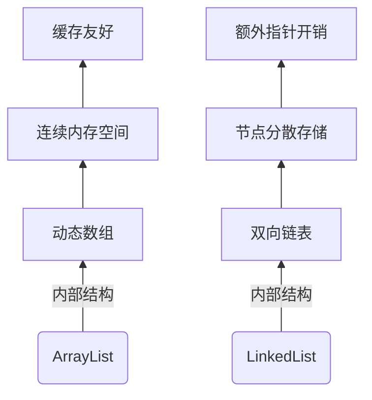

# Collection体系


## Java Collection接口常用方法详解

Collection是Java集合框架中最基础的接口，定义了所有集合类共有的操作方法。以下是其常用方法分类讲解：

### 一、基本操作方法

|           方法签名           |         功能描述         | 返回值 |            示例说明            |
| :--------------------------: | :----------------------: | :----: | :----------------------------: |
|         `int size()`         |   获取集合中元素的数量   |  int   | `list.size(); // 返回元素个数` |
|     `boolean isEmpty()`      |     判断集合是否为空     |  bool  | `set.isEmpty(); // true/false` |
| `boolean contains(Object o)` | 判断集合是否包含指定元素 |  bool  |    `list.contains("Java");`    |


### 二、元素操作方法

|          方法签名          |       功能描述       | 返回值 |       重要说明       |
| :------------------------: | :------------------: | :----: | :------------------: |
|     `boolean add(E e)`     |    向集合添加元素    |  bool  | 不可变集合会抛出异常 |
| `boolean remove(Object o)` |     移除指定元素     |  bool  |   移除成功返回true   |
|       `void clear()`       | 清空集合中的所有元素 |  void  |    集合变为空集合    |


### 三、批量操作方法

|                  方法签名                   |              功能描述              | 返回值 |          示例说明          |
| :-----------------------------------------: | :--------------------------------: | :----: | :------------------------: |
| `boolean addAll(Collection<? extends E> c)` |      添加指定集合中的所有元素      |  bool  | `list.addAll(otherList);`  |
|   `boolean containsAll(Collection<?> c)`    | 判断集合是否包含指定集合的所有元素 |  bool  | `set.containsAll(subset);` |
|    `boolean removeAll(Collection<?> c)`     |   移除所有包含在指定集合中的元素   |  bool  |         取差集操作         |
|    `boolean retainAll(Collection<?> c)`     |    仅保留指定集合中也存在的元素    |  bool  |         取交集操作         |


### 四、转换和遍历方法

|                      方法签名                      |        功能描述        |  返回值  |                   使用示例                    |
| :------------------------------------------------: | :--------------------: | :------: | :-------------------------------------------: |
|              `Iterator<E> iterator()`              |    返回集合的迭代器    | Iterator |               用于遍历集合元素                |
|                `Object[] toArray()`                | 返回包含所有元素的数组 | Object[] |       `Object[] arr = list.toArray();`        |
|              `<T> T[] toArray(T[] a)`              |   返回指定类型的数组   |   T[]    | `String[] arr = list.toArray(new String[0]);` |
| `default void forEach(Consumer<? super E> action)` |  使用Lambda表达式遍历  |   void   |     `list.forEach(System.out::println);`      |

#### 三种遍历方法

##### 1、`for`遍历

```java
// 传统for循环（仅适用于List等有索引的集合）
List<String> fruits = Arrays.asList("Apple", "Banana", "Cherry");
for (int i = 0; i < fruits.size(); i++) {
    String fruit = fruits.get(i);
    System.out.println("水果 #" + i + ": " + fruit);
}

// 增强for循环（适用于所有Collection）
Set<Integer> numbers = new HashSet<>(Arrays.asList(10, 20, 30));
for (Integer num : numbers) {
    System.out.println("数值: " + num);
}
```

##### 2、迭代器遍历

```java
List<String> colors = new ArrayList<>();
colors.add("Red");
colors.add("Green");
colors.add("Blue");

// 使用基本迭代器
Iterator<String> it = colors.iterator();
while (it.hasNext()) {
    String color = it.next();
    
    // 使用迭代器的remove方法安全删除元素
    if (color.startsWith("B")) {
        it.remove(); // 删除以"B"开头的元素
        System.out.println("已删除: " + color);
    } else {
        System.out.println("颜色: " + color);
    }
}

// 使用ListIterator（双向遍历，仅List支持）
ListIterator<String> lit = colors.listIterator();
System.out.println("\n向前遍历:");
while (lit.hasNext()) {
    System.out.println(lit.next());
}

System.out.println("\n向后遍历:");
while (lit.hasPrevious()) {
    System.out.println(lit.previous());
}
```

##### 3、`Lambda`表达式遍历

```java
Queue<String> animals = new ArrayDeque<>(Arrays.asList("Lion", "Tiger", "Bear"));

// 使用forEach + Lambda表达式
System.out.println("所有动物:");
animals.forEach(animal -> 
    System.out.println("• " + animal.toUpperCase())
);

// 使用方法引用
System.out.println("\n筛选后的动物:");
animals.stream()
       .filter(a -> a.contains("i"))
       .forEach(System.out::println);

// 删除元素（Java 8 removeIf）
List<String> cities = new ArrayList<>(Arrays.asList("Paris", "London", "Tokyo"));
cities.removeIf(city -> city.startsWith("L")); // 删除以L开头的城市
System.out.println("\n剩余城市: " + cities);
```

#### 三种遍历方式对比

|     特性     |      `for`循环      |         迭代器         |      Lambda表达式      |
| :----------: | :-----------------: | :--------------------: | :--------------------: |
| **适用集合** | 所有集合（增强for） |        所有集合        |        所有集合        |
| **索引访问** |        支持         |         不支持         |         不支持         |
| **修改元素** |      有限支持       |    支持删除（安全）    |  支持删除（removeIf）  |
| **删除元素** |    可能引发异常     | 通过`remove()`安全删除 | 通过`removeIf`安全删除 |
| **并行处理** |       不支持        |         不支持         | 支持（parallelStream） |
| **链式操作** |       不支持        |         不支持         |   支持（Stream API）   |
| **遍历方向** |        单向         |  双向（ListIterator）  |          单向          |
| **Java版本** |      所有版本       |        所有版本        |        Java 8+         |

#### <font color=red>并发修改问题</font>

```java
package com.n1etzsch3.CollectionDemo1;

import java.util.ArrayList;
import java.util.Iterator;
import java.util.List;

public class ConcurrentException {
    public static void main(String[] args) {
        // 并发修改异常示例
        List<String> list = new ArrayList<>();
        list.add("Java入门");
        list.add("Java进阶");
        list.add("Java高级");
        list.add("Java实战");
        list.add("枸杞养生");
        list.add("CSAPP");
        list.add("数据结构与算法");
        list.add("计算机网络");
        System.out.println(list);

        // 错误示例1：删除全部Java相关书籍
        for(int i = 0; i < list.size(); i++) {
            if(list.get(i).contains("Java")) {
                list.remove(list.get(i));
            }
        }
        // 由于每删掉一个元素，索引就会变化，导致下一个元素的索引可能会被跳过。
        // 例如，删除第0个元素后，原本的第1个元素现在变成了第0个元素，
        // 但循环会继续从原来的第1个元素开始检查，这样就会跳过原来的第1个元素。
        // 这会导致并发修改异常，因为在遍历过程中修改了集合的结构。

        // 解决方案一、每次删除元素后，索引减1
        for(int i = 0; i < list.size(); i++) {
            if(list.get(i).contains("Java")) {
                list.remove(list.get(i));
                i--;  // 删除元素后，索引减1
            }
        }

        // 解决方案二、倒序遍历
        for(int i = list.size() - 1; i >= 0; i--) {
            if(list.get(i).contains("Java")) {
                list.remove(i);  // 倒序删除元素，不会影响未遍历的元素索引
            }
        }

        // 错误示例2：使用增强for循环删除元素
        for(String book : list) {
            if(book.contains("Java")) {
                list.remove(book);  // 这行代码会抛出ConcurrentModificationException异常
            }
        }
        // 增强for循环在遍历时不允许修改集合的结构，
        // 如果尝试在循环中删除元素，会抛出ConcurrentModificationException异常。


        // 错误示例3：使用迭代器删除元素
        Iterator<String> it = list.iterator();
        while (it.hasNext()){
            String book = it.next();
            if(book.contains("Java")) {
                list.remove(book);  // 这行代码会抛出ConcurrentModificationException异常
            }
        }
        // Java的Iterator在遍历时不允许直接修改集合的结构，因为其会维护一个修改计数器，
        // 就是防止可能出现的并发修改异常。

        // 正确的方法是使用Iterator的remove方法来删除元素：
        Iterator<String> iterator = list.iterator();
        while (iterator.hasNext()) {
            String book = iterator.next();
            if (book.contains("Java")) {
                iterator.remove();  // 使用Iterator的remove方法删除元素
            }
        }

        // 错误示例4：使用forEach删除元素
        list.forEach(book -> {
            if (book.contains("Java")) {
                list.remove(book);  // 这行代码会抛出ConcurrentModificationException异常
                // forEach方法在遍历时不允许修改集合的结构，因为底层也是基于迭代器实现的。
                // 如果尝试在Lambda表达式中删除元素，会抛出ConcurrentModificationException异常。
            }
        });

        // 正确的方法是使用List的removeIf方法，它允许使用Lambda表达式删除元素：
        list.removeIf(book -> book.contains("Java"));  // 这行代码是正确的，使用Lambda表达式删除元素

        System.out.println(list);

        // 总结：在遍历集合时，如果需要删除元素，应该使用Iterator的remove方法或List的removeIf方法，
        // 避免直接使用集合的remove方法或在增强for循环中删除元素，以防止抛出ConcurrentModificationException异常。
        // 如果集合支持索引，可以使用for循环遍历，然后每删除一个元素，索引减1；或倒序遍历来避免并发修改异常。

        // 注意：增强for循环和forEach方法在遍历时不允许修改集合的结构，
        // 因为它们底层使用的是迭代器，而迭代器在遍历时维护了一个修改计数器。
    }
}

```


### 五、Java 8新增实用方法

|                        方法签名                         |      功能描述      |   返回值    |               使用场景                |
| :-----------------------------------------------------: | :----------------: | :---------: | :-----------------------------------: |
| `default boolean removeIf(Predicate<? super E> filter)` | 删除满足条件的元素 |    bool     | `list.removeIf(s -> s.length() < 3);` |
|         `default Spliterator<E> spliterator()`          |  创建可分割迭代器  | Spliterator |            并行流处理基础             |
|              `default Stream<E> stream()`               |     返回顺序流     |   Stream    |           函数式操作数据源            |
|          `default Stream<E> parallelStream()`           |  返回可能并行的流  |   Stream    |          并行处理大规模数据           |


### 六、代码示例

```java
List<String> languages = new ArrayList<>();

// 添加元素
languages.add("Java");       // [Java]
languages.add("Python");     // [Java, Python]

// 批量操作
List<String> others = List.of("C++", "JavaScript");
languages.addAll(others);    // [Java, Python, C++, JavaScript]

// 检查包含
System.out.println(languages.contains("Java")); // true

// 删除元素
languages.remove("C++");     // [Java, Python, JavaScript]

// 遍历集合
System.out.println("\n遍历方法：");
// 1. 增强for循环
for (String lang : languages) {
    System.out.println(lang);
}

// 2. 迭代器（可安全删除元素）
Iterator<String> it = languages.iterator();
while (it.hasNext()) {
    String lang = it.next();
    if (lang.startsWith("J")) {
        it.remove();
    }
}

// 3. Java 8 forEach
languages.forEach(lang -> System.out.println("Lang: " + lang));

// 批量删除
languages.removeIf(lang -> lang.length() < 6); // 移除长度<6的元素

// 流操作
long count = languages.stream()
                      .filter(lang -> lang.contains("a"))
                      .count();
                      
System.out.println("\n最终集合：" + languages);
```


## List系列集合

**List系列集合的特点是：有序，可重复，有索引**


### List特有方法

#### 索引相关操作

|           方法签名            | 返回值  |      功能描述      |               示例                |
| :---------------------------: | :-----: | :----------------: | :-------------------------------: |
| **add(int index, E element)** | boolean | 在指定位置插入元素 |      `list.add(0, "First")`       |
| **set(int index, E element)** |    E    |  替换指定位置元素  |     `list.set(0, "Updated")`      |
|      **get(int index)**       |    E    |  获取指定位置元素  |    `String item = list.get(0)`    |
|     **remove(int index)**     |    E    |  移除指定位置元素  | `String removed = list.remove(0)` |

#### 查找与范围操作

|                方法签名                 | 返回值 |        功能描述        |                   示例                   |
| :-------------------------------------: | :----: | :--------------------: | :--------------------------------------: |
|          **indexOf(Object o)**          |  int   |   获取首次出现的索引   |     `int pos = list.indexOf("Java")`     |
|        **lastIndexOf(Object o)**        |  int   | 获取最后一次出现的索引 | `int lastPos = list.lastIndexOf("Java")` |
| **subList(int fromIndex, int toIndex)** |  List  | 获取子列表（前闭后开） | `List<String> sub = list.subList(0, 3)`  |

#### 迭代相关

|          方法签名           |    返回值    |          功能描述          |                       示例                       |
| :-------------------------: | :----------: | :------------------------: | :----------------------------------------------: |
|     **listIterator()**      | ListIterator |       获取列表迭代器       | `ListIterator<String> it = list.listIterator()`  |
| **listIterator(int index)** | ListIterator | 从指定位置开始的列表迭代器 | `ListIterator<String> it = list.listIterator(2)` |


### `ArrayList`

#### 1. 核心实现

- **数据结构**：内部维护Object数组`elementData`
- **扩容机制**：自动扩容数组大小
- **特性**：允许null值，快速随机访问



#### 2. 扩容策略总结

|     情况     | 初始容量 | 扩容方式  |               新容量计算               |
| :----------: | :------: | :-------: | :------------------------------------: |
|   默认构造   |    0     | 首次添加  |                   10                   |
| 指定容量构造 |    n     | 首次溢出  |                n + n/2                 |
|  增量较大时  |    -     | 按需求扩  |              minCapacity               |
|  大容量场景  |   >64    | 按50%递增 | oldCapacity + max(增量, oldCapacity/2) |

#### 3.ArrayList独有方法

##### 容量控制

|              方法签名               | 返回值 |      功能描述      |        原理说明        |            示例            |
| :---------------------------------: | :----: | :----------------: | :--------------------: | :------------------------: |
| **ensureCapacity(int minCapacity)** |  void  |    确保最小容量    | 提前扩容以避免多次扩容 | `list.ensureCapacity(100)` |
|          **trimToSize()**           |  void  | 裁剪为当前实际大小 |  释放未使用的数组空间  |    `list.trimToSize()`     |


### `LinkedList`

即链表，和C语言的实现差不多。

#### 特有方法

##### 双端队列操作（Deque接口）

|     方法签名      | 返回值 |    功能描述    |      等效实现      |                示例                |
| :---------------: | :----: | :------------: | :----------------: | :--------------------------------: |
| **addFirst(E e)** |  void  | 添加元素到头部 |    `add(0, e)`     |      `list.addFirst("Head")`       |
| **addLast(E e)**  |  void  | 添加元素到尾部 |      `add(e)`      |       `list.addLast("Tail")`       |
| **removeFirst()** |   E    |  移除头部元素  |    `remove(0)`     | `String head = list.removeFirst()` |
| **removeLast()**  |   E    |  移除尾部元素  | `remove(size()-1)` | `String tail = list.removeLast()`  |
|  **getFirst()**   |   E    |  获取头部元素  |      `get(0)`      |  `String first = list.getFirst()`  |
|   **getLast()**   |   E    |  获取尾部元素  |  `get(size()-1)`   |   `String last = list.getLast()`   |

##### 栈操作

|   方法签名    | 返回值 |     功能描述     |    等效实现     |           示例            |
| :-----------: | :----: | :--------------: | :-------------: | :-----------------------: |
| **push(E e)** |  void  | 压栈（头部添加） |  `addFirst(e)`  |    `list.push("Item")`    |
|   **pop()**   |   E    | 出栈（头部移除） | `removeFirst()` | `String top = list.pop()` |

##### 队列安全操作

|      方法签名       | 返回值  |   功能描述   |      区别说明       |               示例               |
| :-----------------: | :-----: | :----------: | :-----------------: | :------------------------------: |
| **offerFirst(E e)** | boolean | 安全添加头部 | 容量受限时返回false |   `list.offerFirst("NewHead")`   |
| **offerLast(E e)**  | boolean | 安全添加尾部 | 容量受限时返回false |   `list.offerLast("NewTail")`    |
|   **peekFirst()**   |    E    | 查看头部元素 |   空列表返回null    | `String head = list.peekFirst()` |
|   **peekLast()**    |    E    | 查看尾部元素 |   空列表返回null    | `String tail = list.peekLast()`  |
|   **pollFirst()**   |    E    | 安全移除头部 |   空列表返回null    | `String item = list.pollFirst()` |
|   **pollLast()**    |    E    | 安全移除尾部 |   空列表返回null    | `String item = list.pollLast()`  |


### `ArrayList`和`LinkedList`对比

#### 数据结构差异



#### 时间复杂度对比（典型操作）

|   操作   | ArrayList | LinkedList |        适用场景推荐        |
| :------: | :-------: | :--------: | :------------------------: |
| 随机访问 |   O(1)    |    O(n)    | 大量随机访问优先ArrayList  |
| 头部插入 |   O(n)    |    O(1)    | 频繁头部操作优先LinkedList |
| 尾部插入 |   O(1)    |    O(1)    |          两者均可          |
| 中间插入 |   O(n)    |    O(n)    |      根据已有位置选择      |
| 头部删除 |   O(n)    |    O(1)    | 频繁头部删除优先LinkedList |
| 尾部删除 |   O(1)    |    O(1)    |          两者均可          |
| 中间删除 |   O(n)    |    O(n)    |      根据已有位置选择      |

#### 最佳实践与选型指南

##### 选择ArrayList的典型场景：

1. 频繁按索引随机访问元素
2. 主要在尾部添加/删除元素
3. 需要节省内存空间时（每个元素约省24字节）
4. 元素数量稳定且可预估时

##### 选择LinkedList的典型场景：

1. 频繁在头尾添加/删除元素
2. 实现先进先出(FIFO)或后进先出(LIFO)结构
3. 需要减少中间插入开销时（不需要移动元素）
4. 内存充足且不关心随机访问性能时

>  <font color=red>**黄金法则**：当不确定选择哪种List时，优先选用ArrayList，它在大多数场景下有更好的综合性能。</font>