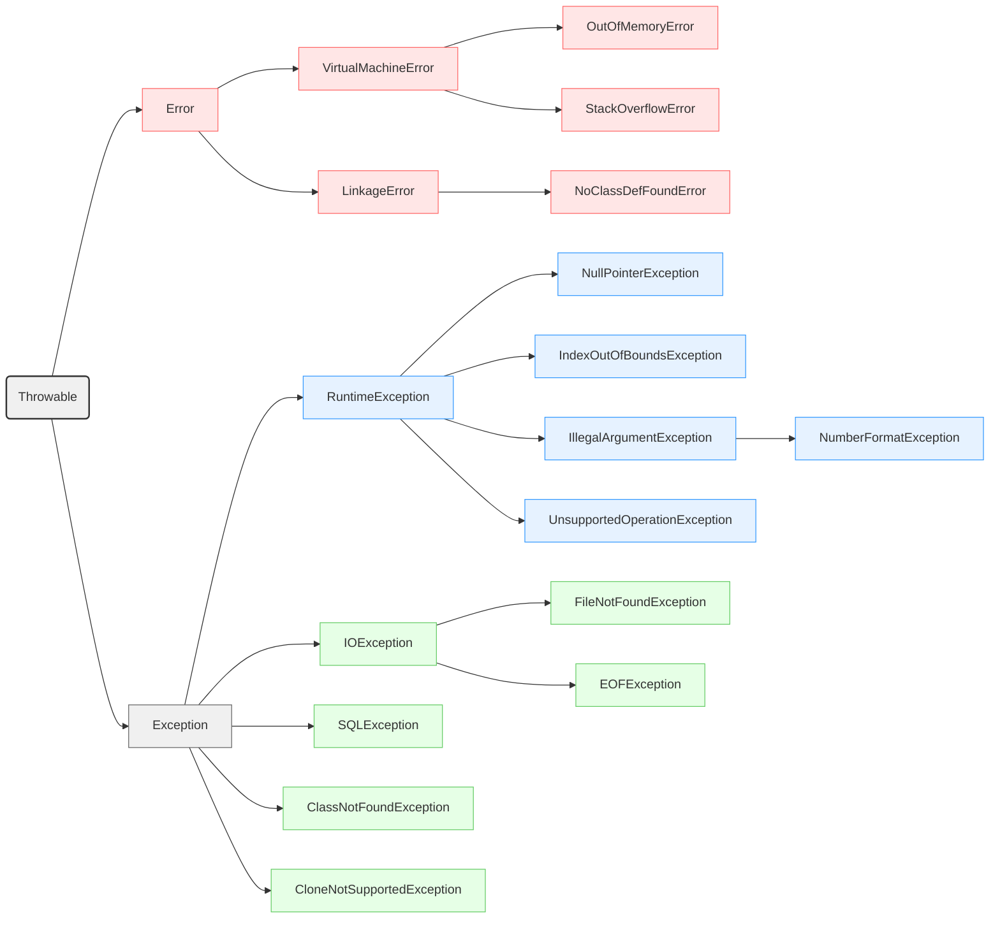

# 异常


## Java的异常体系

### 分类

<font color=red>**用 `Java.lang.Throwable` 代表Java中所有的异常，是异常的顶级父类**</font>

**`Java.lang.Throwable`下又有`Error`和`Exception`。**

+ **Error**：代表系统级别错误，属于严重问题，开发人员一般无法解决。

+ **Exception**
  + **`RuntiomeException`**：运行时异常，编译阶段不会出现错误提示，运行时出现异常。（如：空指针）
  + **其他异常**：编译阶段就会出现错误提醒。<font color=red>不处理报错，编译不通过，程序不执行。</font>（如：日期解析异常）



### 代码示例

#### 运行时异常

以经典的**运行时异常：空指针异常**举例子：

```java
package com.n1etzsch3.exceptiondemo1;

public class ExceptionDemo1 {
    public static void main(String[] args) {
        show();
    }
    
    public static void show(){
        String str = null;
        System.out.println(str.length()); // NullPointerException
    }
}

```

**抛出异常：**

```java
Exception in thread "main" java.lang.NullPointerException: Cannot invoke "String.length()" because "str" is null
	at com.n1etzsch3.exceptiondemo1.ExceptionDemo1.show(ExceptionDemo1.java:10)
	at com.n1etzsch3.exceptiondemo1.ExceptionDemo1.main(ExceptionDemo1.java:5)
```


#### 编译时异常

**以解析字符串为时间戳举例：**

```java
package com.n1etzsch3.exceptiondemo1;

import java.text.SimpleDateFormat;
import java.util.Date;

public class ExceptionDemo1 {
    public static void main(String[] args) {
        show();
    }

    public static void show(){
        String time = "2025-06-14 14:06:29";
        // 将字符串解析为时间戳
        SimpleDateFormat sdf = new SimpleDateFormat("yyyy-MM-dd HH:mm:ss");
        Date date = sdf.parse(time);  // java.text.ParseException
        System.out.println(date);
    }
}
```

**报错：**

```java
java: 未报告的异常错误java.text.ParseException; 必须对其进行捕获或声明以便抛出
```


## 异常的作用

+ **异常是用来定位程序bug的关键信息。**
+ **可以作为方法内部的一种特殊返回值，以便通知上曾调用者，方法的执行问题。**

```java
package com.n1etzsch3.exceptiondemo1;

public class ExceptionDemo2 {
    public static void main(String[] args) {
        System.out.println(divide(10, 0));
        System.out.println(divide(2, 3));
    }

    // 异常作为一种特殊的返回值
    public static double divide(double a, double b) {
        if (b == 0) {
            throw new ArithmeticException("除数不能为零");
        }
        return a / b;
    }
}
```

**输出**

```java
Exception in thread "main" java.lang.ArithmeticException: 除数不能为零
	at com.n1etzsch3.exceptiondemo1.ExceptionDemo2.divide(ExceptionDemo2.java:12)
	at com.n1etzsch3.exceptiondemo1.ExceptionDemo2.main(ExceptionDemo2.java:5)
```

> **异常会截断程序。**


## 自定义异常

### 自定义运行时异常

+ 定义一个异常类**继承`RuntimeException`**。
+ 重写构造器。
+ 通过**`throw new 异常类()`**来创建异常对象并抛出。
+ **特点：编译阶段不报错，运行阶段报错，不激进。**

**示例代码**

```java
package com.n1etzsch3.exceptiondemo1;

public class IllegalAgeRuntimeException extends RuntimeException{
    public IllegalAgeRuntimeException(){}
    public IllegalAgeRuntimeException(String message){
        super(message);
    }
}
```

```java
package com.n1etzsch3.exceptiondemo1;

public class ExceptionDemo3 {
    public static void main(String[] args) {
            checkAge(1100);		// 编译时不会报错，运行时才会报错
    }

    // 需求：如果年龄不满18岁，抛出未成年异常。如果年龄小于0岁，或者大于150岁，抛出年龄错误异常
    public static void checkAge(int age) throws IllegalAgeRuntimeException{
        if (age < 18 && age >= 0) {
            throw new IllegalAgeRuntimeException("未成年异常：年龄必须大于等于18岁");
        }

        if (age < 0 || age > 150){
            throw new IllegalAgeRuntimeException("年龄数值非法！");
        }
    }
}
```


### 自定义编译时异常

+ 定义一个异常类**继承`Exception`**。
+ 重写构造器。
+ 通过**`throw new 异常类()`**创建异常对象并抛出。
+ **特点：编译阶段就报错，比较激进。**

**示例代码**

```java
package com.n1etzsch3.exceptiondemo1;

/**
 * 自定义编译时异常：
 * 1、继承Exception。
 * 2、重写构造器。
 */

public class IllegalAgeException extends Exception {
    public IllegalAgeException(){
    }
    public IllegalAgeException(String message){
        super(message);
    }
}
```

```java
package com.n1etzsch3.exceptiondemo1;

public class ExceptionDemo3 {
    public static void main(String[] args) {
        try {
            checkAge(1100);		// 如果不处理异常，编译不通过，要么抛出，要么捕获。
        }
        catch (IllegalAgeException e) {
            e.printStackTrace();	// 输出异常信息
            System.out.println("程序执行失败！");
        }
    }

    // 需求：如果年龄不满18岁，抛出未成年异常。如果年龄小于0岁，或者大于150岁，抛出年龄错误异常
    public static void checkAge(int age) throws IllegalAgeException{
        if (age < 18 && age >= 0) {
            throw new IllegalAgeException("未成年异常：年龄必须大于等于18岁");
        }

        if (age < 0 || age > 150){
            throw new IllegalAgeException("年龄数值非法！");
        }
    }
}
```

**输出**

```java
com.n1etzsch3.exceptiondemo1.IllegalAgeException: 年龄数值非法！
	at com.n1etzsch3.exceptiondemo1.ExceptionDemo3.checkAge(ExceptionDemo3.java:21)
	at com.n1etzsch3.exceptiondemo1.ExceptionDemo3.main(ExceptionDemo3.java:6)
程序执行失败！
```

> **<font color=red>Java官方不建议使用编译时异常。</font>**


## 异常的处理

### 抛出异常`throws`

### 捕获异常`try...catch`

### 方案1（推荐）：

**底层异常层层往上抛出，最外层捕获异常，记录下异常信息，并响应给用户观看合适的信息进行提示。**

```java
package com.n1etzsch3.exceptiondemo1;

public class ExceptionDemo3 {
    public static void main(String[] args) {
        try {
            checkAge(1100);
            System.out.println("年龄合法");
        } catch (Exception e) {
            e.printStackTrace();
            System.out.println("年龄不合法");
        }
    }

    // 需求：如果年龄不满18岁，抛出未成年异常。如果年龄小于0岁，或者大于150岁，抛出年龄错误异常
    public static void checkAge(int age) throws Exception{
        if (age < 18 && age >= 0) {
            throw new IllegalAgeRuntimeException("未成年异常：年龄必须大于等于18岁");
        }

        if (age < 0 || age > 150){
            throw new IllegalAgeRuntimeException("年龄数值非法！");
        }
    }
}
```

>  推荐写法： **使用`Exception`捕获所有类型的异常。**


### 方案2：

**最外层捕获异常后，尝试重新修复。**

```java
package com.n1etzsch3.exceptiondemo1;

import java.util.Scanner;

public class ExceptionDemo4 {
    public static void main(String[] args) {
        while (true) {
            try {
                double price = userInputPrice();
                System.out.println("Price entered: " + price);
                break;
            } catch (Exception e) {
                // e.printStackTrace();  // 面向用户不用将异常细节抛出
              	// 选择合适的内容展示给用户。
                System.out.println("Invalid input. Please enter a valid price.");
            }
        }
    }

    public static double userInputPrice(){
        Scanner sc = new Scanner(System.in);
        System.out.println("Please enter a price:");
        double price = sc.nextDouble();
        return price;
    }
}
```

