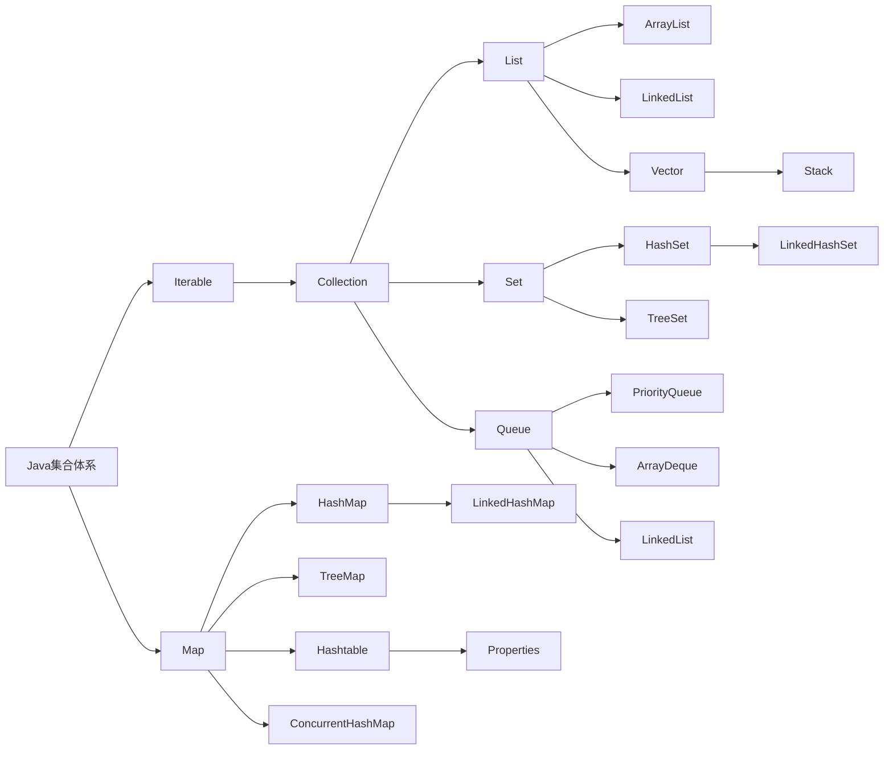
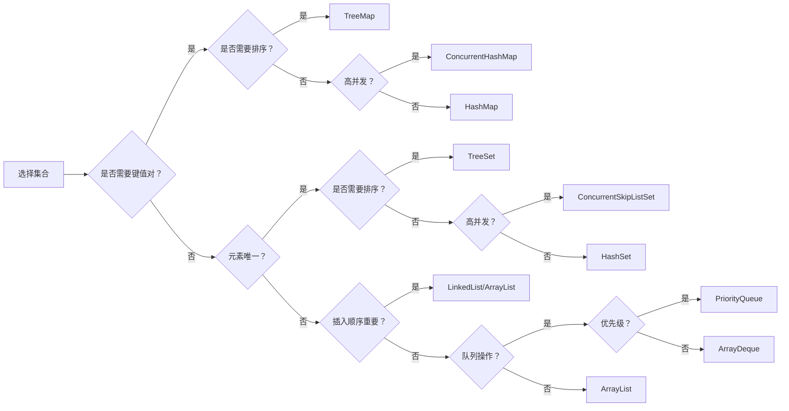

# 数据结构

## 总体结构概述

Java集合框架由`Iterable`和`Map`两大体系构成：

- **Iterable**：所有集合类型的根接口，支持迭代操作
- **Collection**：Iterable的子接口，表示对象集合
- **Map**：键值对映射集合，独立于Collection体系

### 一、Collection体系

#### 1. List接口（有序可重复）

|     实现类     | 数据结构 | 线程安全 |               特点               |
| :------------: | :------: | :------: | :------------------------------: |
| **ArrayList**  | 动态数组 |    ❌     |      随机访问快，插入删除慢      |
| **LinkedList** | 双向链表 |    ❌     |      插入删除快，随机访问慢      |
|     Vector     | 动态数组 |    ✅     |  线程安全的ArrayList（已过时）   |
|     Stack      |   数组   |    ✅     | LIFO结构（继承自Vector，已过时） |

#### 2. Set接口（无序不重复）

|    实现类     |    数据结构     |    排序    |          特点          |
| :-----------: | :-------------: | :--------: | :--------------------: |
|  **HashSet**  |     哈希表      | 不保证顺序 |  高性能，允许null元素  |
| LinkedHashSet | 哈希表+双向链表 |  插入顺序  |      保持插入顺序      |
|  **TreeSet**  |     红黑树      | 自然/指定  | 自动排序，支持范围查找 |

#### 3. Queue接口（队列）

|      实现类       | 数据结构 |             特点             |
| :---------------: | :------: | :--------------------------: |
| **PriorityQueue** |  二叉堆  | 优先级队列，按元素优先级出队 |
|  **ArrayDeque**   | 循环数组 |  双端队列，高效实现栈和队列  |
|    LinkedList     |   链表   |     可用作队列/双端队列      |

### 二、Map体系（键值对映射）

|        实现类         |     数据结构     | 线程安全 |     排序      |             特点             |
| :-------------------: | :--------------: | :------: | :-----------: | :--------------------------: |
|      **HashMap**      | 数组+链表/红黑树 |    ❌     |     无序      |    常用实现，允许null键值    |
|   **LinkedHashMap**   | 哈希表+双向链表  |    ❌     | 插入/访问顺序 |    保持插入顺序或访问顺序    |
|      **TreeMap**      |      红黑树      |    ❌     |    键排序     | 按键自然顺序或Comparator排序 |
|       HashTable       |      哈希表      |    ✅     |     无序      |  线程安全但效率低（已过时）  |
|      Properties       |      哈希表      |    ✅     |     无序      | 配置文件专用，键值均为String |
| **ConcurrentHashMap** |    分段锁/CAS    |    ✅     |     无序      |        高并发场景首选        |

### 三、最佳实践指南

#### 1. 选择原则

- **随机访问多**：ArrayList
- **频繁增删**：LinkedList
- **元素唯一**：HashSet（无序）/TreeSet（有序）
- **键值存储**：HashMap（无序）/TreeMap（有序）
- **任务调度**：PriorityQueue
- **高效队列**：ArrayDeque
- **并发环境**：ConcurrentHashMap，CopyOnWriteArrayList

#### 2. 性能考量

#### 3. 关键注意事项

1. 正确重写`hashCode()`和`equals()`（HashMap/HashSet使用）
2. 实现`Comparable`接口或提供`Comparator`（TreeMap/TreeSet使用）
3. 避免在迭代过程中修改集合（使用Iterator安全删除）
4. 预分配集合大小（减少扩容开销）
5. 多线程环境下优先使用并发集合类