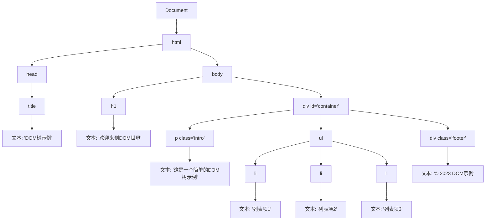

# DOM操作

**作用：**用js操作html和浏览器。

**分类：**DOM（文档操作模型）、BOM（浏览器操作模型）。


## DOM树

​	DOM主要用来操作网页内容，将HTML文档以树状结构直观的表现出来，成为DOM树。

**例如**




**其对应的HTML文档为：**

```html
<!DOCTYPE html>
<html>
<head>
    <title>DOM树示例</title>
</head>
<body>
    <h1>欢迎来到DOM世界</h1>
    <div id="container">
        <p class="intro">这是一个简单的DOM树示例</p>
        <ul>
            <li>列表项1</li>
            <li>列表项2</li>
            <li>列表项3</li>
        </ul>
        <div class="footer">© 2023 DOM示例</div>
    </div>
</body>
</html>
```


## 获取DOM对象

### 1、根据CSS选择器来获取DOM元素

选择匹配的第一个元素`document.querySelector('CSS选择器')`。


